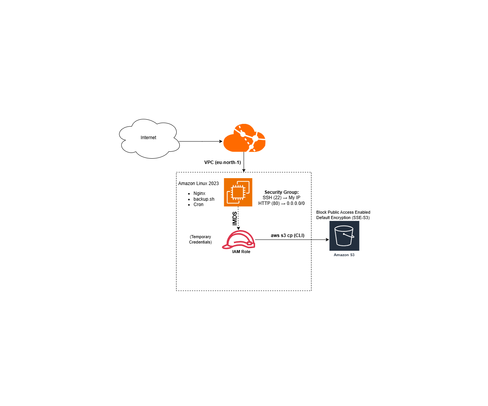

### Automated EC2 to S3 Backup System

### Overview

This project demonstrates a secure and automated backup solution on AWS using EC2, S3, IAM Roles, Bash scripting, and Cron scheduling.

The EC2 instance compresses local files and uploads them to an encrypted S3 bucket using temporary credentials obtained via IAM Role and Instance Metadata Service (IMDS).

### Architecture Diagram 

### Architecture Explanation

- EC2 instance runs Amazon Linux 2023 with Nginx and a backup script.
- Cron scheduler automates daily execution of the backup process.
- IAM Role provides temporary credentials via IMDS.
- Backup files are securely uploaded to Amazon S3 using AWS CLI.
- S3 bucket has Block Public Access enabled and default encryption (SSE-S3).

### Architecture Components

Amazon EC2 (Amazon Linux 2023)

IAM Role (EC2-S3-Access-Role)

Amazon S3 (Block Public Access Enabled, SSE-S3 Encryption)

AWS CLI

Bash Script

Cron Scheduler

### Security Best Practices Implemented

IAM Role attached to EC2 (No hardcoded credentials)

Temporary credentials via IMDS

S3 Block Public Access enabled

Default encryption (SSE-S3)

Security Group restricted SSH access

### Automation

Cron Job:

0 2 \* \* \* /home/ec2-user/backup.sh >> /home/ec2-user/backup.log 2>\&1

Runs daily at 2 AM (UTC).

### Key Learnings

Secure service-to-service authentication using IAM Roles

Linux automation using Cron

S3 storage management

AWS networking fundamentals

Production-level cloud security practices

